# ARCHITECTURE — Projectwise

> Maintained by `arch-scribe` (Haiku). Edit via the agent, not by hand.

```mermaid
flowchart TD
    CLI["<b>CLI</b><br/>(clap subcommands)"]
    MAIN["<b>main.rs</b><br/>(entry, cmd dispatch)"]
    REG["<b>RegistryManager</b><br/>(registry.rs)"]
    MODELS["<b>models.rs</b><br/>(Project, Registry types)"]
    THEME["<b>theme.rs</b><br/>(opaline styling)"]
    
    CMD_LIST["<b>cmd_list</b><br/>(Ratatui TUI spawn)"]
    RUN_LIST_UI["<b>run_list_ui</b><br/>(event loop + tabs)"]
    TREE["<b>filetree.rs</b><br/>(directory widget)"]
    SESSIONS["<b>sessions.rs</b><br/>(session logging)"]
    
    PROJECTS_TAB["<b>Projects Tab</b><br/>(table + tree + info)"]
    TOKENIZER_TAB["<b>Tokenizer Tab</b><br/>(status + actions)"]
    CLAUDEMD_TAB["<b>CLAUDE.md Tab</b><br/>(scrollable view + edit)"]
    RULES_TAB["<b>RULES Tab</b><br/>(list + preview + edit)"]
    
    FZF_SEARCH["<b>FZF Search</b><br/>(/forward key)"]
    TOKENIZER_BIN["<b>tokenizer</b> binary<br/>(context optimizer)"]
    
    CMD_PRELUNCH["<b>cmd_pre_launch</b><br/>(context builder)"]
    BUILD_DIGEST["<b>build_context_digest</b><br/>(markdown generator)"]
    STRIP_HTML["<b>strip_html</b><br/>(PROGRESS fallback)"]
    
    REG_JSON["<b>~/.claude/projects/<br/>.registry.json</b><br/>(project registry)"]
    TASKS_JSON["<b>~/.claude/progress/<br/>tasks.json</b><br/>(progress data)"]
    ARCH_MD["<b>ARCHITECTURE.md</b><br/>(runtime snapshot)"]
    DIGEST_MD["<b>context-digest.md</b><br/>(pre-launch snapshot)"]
    
    CLAUDEMD_GLOBAL["<b>~/.claude/CLAUDE.md</b><br/>(global rules)"]
    CLAUDEMD_PROJECT["<b>~/CLAUDE.md</b><br/>(project rules)"]
    RULES_STEMS["<b>~/.claude/rules/*.{md,toon}</b><br/>(rule files)"]
    TOKENIZER_MANIFEST["<b>tokenizer manifest.jsonl<br/>+ backups/</b><br/>(rule backups)"]
    EDIT_FILE["<b>edit_file_external</b><br/>($EDITOR suspend/resume)"]
    SAVE_RULE_EDIT["<b>save_rule_edit</b><br/>(write + roundtrip)"]
    
    CLAUDE_CLI["<b>claude</b> CLI<br/>(external)"]
    
    CLI -->|invoke| MAIN
    MAIN -->|uses| REG
    MAIN -->|uses| MODELS
    MAIN -->|uses| THEME
    MAIN -->|dispatch: list| CMD_LIST
    MAIN -->|dispatch: pre-launch| CMD_PRELUNCH
    
    CMD_LIST -->|spawn TUI| RUN_LIST_UI
    RUN_LIST_UI -->|render| PROJECTS_TAB
    RUN_LIST_UI -->|render| TOKENIZER_TAB
    RUN_LIST_UI -->|render| CLAUDEMD_TAB
    RUN_LIST_UI -->|render| RULES_TAB
    RUN_LIST_UI -->|loads| REG
    RUN_LIST_UI -->|loads| TASKS_JSON
    
    PROJECTS_TAB -->|uses| TREE
    PROJECTS_TAB -->|uses| THEME
    RUN_LIST_UI -->|on /| FZF_SEARCH
    TOKENIZER_TAB -->|spawns| TOKENIZER_BIN
    
    CLAUDEMD_TAB -->|reads| CLAUDEMD_GLOBAL
    CLAUDEMD_TAB -->|reads| CLAUDEMD_PROJECT
    CLAUDEMD_TAB -->|edit| EDIT_FILE
    
    RULES_TAB -->|lists| RULES_STEMS
    RULES_TAB -->|reads backup| TOKENIZER_MANIFEST
    RULES_TAB -->|edit-save round-trip| SAVE_RULE_EDIT
    SAVE_RULE_EDIT -->|reconvert| TOKENIZER_BIN
    
    RULES_MD_MIRROR["<b>rules-md mirror</b><br/>(~/.claude/rules-md/)"]
    RULES_SYNC["<b>cpm rules-sync</b><br/>(idempotent bootstrap)"]
    MD_TO_TOON["<b>md_to_toon converter</b><br/>(md→json→toon)"]
    COMPILE_RULE["<b>compile_rule_master</b><br/>(md→toon + refresh)"]
    ENSURE_TOON_SYMLINK["<b>ensure_toon_symlink</b><br/>(md ↔ .toon link)"]
    RULES_MD_DIR["<b>rules_md_dir</b><br/>(helper function)"]
    MD_TO_JSON_CLI["<b>md_to_json</b><br/>(external CLI)"]
    TOON_CLI["<b>toon</b> CLI<br/>(external)"]
    RULES_ONLY["<b>~/.claude/rules/<br/>*.toon only</b><br/>(compiled rules store)"]
    
    MAIN -->|dispatch: rules-sync| RULES_SYNC
    RULES_SYNC -->|builds mirror| RULES_MD_MIRROR
    RULES_SYNC -->|calls| COMPILE_RULE
    RULES_SYNC -->|idempotent rebuild| RULES_ONLY
    
    COMPILE_RULE -->|calls| MD_TO_TOON
    COMPILE_RULE -->|calls| ENSURE_TOON_SYMLINK
    MD_TO_TOON -->|uses| MD_TO_JSON_CLI
    MD_TO_TOON -->|uses| TOON_CLI
    MD_TO_TOON -->|writes atomic| RULES_ONLY
    ENSURE_TOON_SYMLINK -->|symlinks to| RULES_MD_MIRROR
    
    RULES_MD_MIRROR -->|contains| RULES_MD_DIR
    RULES_TAB -->|edits master| RULES_MD_MIRROR
    RULES_TAB -->|calls on save| COMPILE_RULE
    RULES_TAB -->|prefers readable .md| RULES_MD_MIRROR
    
    CMD_PRELUNCH -->|reads| REG
    CMD_PRELUNCH -->|reads| TASKS_JSON
    CMD_PRELUNCH -->|reads| ARCH_MD
    CMD_PRELUNCH -->|calls| BUILD_DIGEST
    BUILD_DIGEST -->|fallback| STRIP_HTML
    BUILD_DIGEST -->|writes| DIGEST_MD
    
    CMD_PRELUNCH -->|logs| SESSIONS
    
    FZF_SEARCH -->|external| FZF["fzf<br/>(interactive picker)"]
    TOKENIZER_BIN -->|external binary|TOKBIN["tokenizer<br/>(optimizer)"]
    CMD_PRELUNCH -->|finally| CLAUDE_CLI
    CLAUDE_CLI -->|absorbs| DIGEST_MD
    
    REG -->|manages| REG_JSON
    
    style CLI fill:#94A3B8,stroke:#64748B,color:#000
    style MAIN fill:#94A3B8,stroke:#64748B,color:#000
    style REG fill:#94A3B8,stroke:#64748B,color:#000
    style MODELS fill:#94A3B8,stroke:#64748B,color:#000
    style THEME fill:#94A3B8,stroke:#64748B,color:#000
    style CMD_LIST fill:#0EA5E9,stroke:#0284C7,color:#000
    style RUN_LIST_UI fill:#0EA5E9,stroke:#0284C7,color:#000
    style TREE fill:#0EA5E9,stroke:#0284C7,color:#000
    style SESSIONS fill:#0EA5E9,stroke:#0284C7,color:#000
    style PROJECTS_TAB fill:#06B6D4,stroke:#0891B2,color:#000
    style TOKENIZER_TAB fill:#06B6D4,stroke:#0891B2,color:#000
    style CLAUDEMD_TAB fill:#06B6D4,stroke:#0891B2,color:#000
    style RULES_TAB fill:#06B6D4,stroke:#0891B2,color:#000
    style FZF_SEARCH fill:#10B981,stroke:#059669,color:#fff
    style TOKENIZER_BIN fill:#10B981,stroke:#059669,color:#fff
    style CMD_PRELUNCH fill:#F59E0B,stroke:#D97706,color:#000
    style BUILD_DIGEST fill:#F59E0B,stroke:#D97706,color:#000
    style STRIP_HTML fill:#F59E0B,stroke:#D97706,color:#000
    style REG_JSON fill:#EC4899,stroke:#BE185D,color:#fff
    style TASKS_JSON fill:#EC4899,stroke:#BE185D,color:#fff
    style ARCH_MD fill:#EC4899,stroke:#BE185D,color:#fff
    style DIGEST_MD fill:#EC4899,stroke:#BE185D,color:#fff
    style CLAUDEMD_GLOBAL fill:#EC4899,stroke:#BE185D,color:#fff
    style CLAUDEMD_PROJECT fill:#EC4899,stroke:#BE185D,color:#fff
    style RULES_STEMS fill:#EC4899,stroke:#BE185D,color:#fff
    style TOKENIZER_MANIFEST fill:#EC4899,stroke:#BE185D,color:#fff
    style EDIT_FILE fill:#F59E0B,stroke:#D97706,color:#000
    style SAVE_RULE_EDIT fill:#F59E0B,stroke:#D97706,color:#000
    style RULES_MD_MIRROR fill:#EC4899,stroke:#BE185D,color:#fff
    style RULES_SYNC fill:#0EA5E9,stroke:#0284C7,color:#000
    style MD_TO_TOON fill:#10B981,stroke:#059669,color:#fff
    style COMPILE_RULE fill:#F59E0B,stroke:#D97706,color:#000
    style ENSURE_TOON_SYMLINK fill:#10B981,stroke:#059669,color:#fff
    style RULES_MD_DIR fill:#F59E0B,stroke:#D97706,color:#000
    style MD_TO_JSON_CLI fill:#8B5CF6,stroke:#7C3AED,color:#fff
    style TOON_CLI fill:#8B5CF6,stroke:#7C3AED,color:#fff
    style RULES_ONLY fill:#EC4899,stroke:#BE185D,color:#fff
    style CLAUDE_CLI fill:#8B5CF6,stroke:#7C3AED,color:#fff
    style FZF fill:#8B5CF6,stroke:#7C3AED,color:#fff
    style TOKBIN fill:#8B5CF6,stroke:#7C3AED,color:#fff
```

## Components

- **CLI** (`src/main.rs` lines 71–80) — clap Cli struct and subcommand enum; dispatches all CLI entry points.
- **main.rs** (`src/main.rs`) — main() entry point, command dispatcher for select/list/preview/pre-launch/registry/cleanup/integrity/shell-init.
- **RegistryManager** (`src/registry.rs`) — reads/writes ~/.claude/projects/.registry.json; manages project metadata with file locking.
- **models.rs** (`src/models.rs`) — Project, Registry, RegistryMeta, ProjectStatus, ListMode enum types.
- **theme.rs** (`src/theme.rs`) — opaline color palette (accent, dim, border, header styles) for Ratatui widgets.
- **cmd_list** (`src/main.rs` lines 306–358) — parses mode, spawns Ratatui terminal in select or normal mode, calls run_list_ui.
- **run_list_ui** (`src/main.rs` lines 876+) — event loop for TUI; manages tab state (Projects/Tokenizer), selected row, focus, overlay, keybindings.
- **Projects Tab** (`src/main.rs` render_projects_tab) — 3-panel layout: table (projects), filetree (right), info (far right); responsive to terminal width.
- **Tokenizer Tab** (`src/main.rs` lines 681–748 render_tokenizer_tab) — displays status (binary/timer/hook) and action keys (o=optimize, T=full TUI, i=install timer, h=install hook).
- **CLAUDE.md Tab** (`src/main.rs` render_text_tab) — scrollable view of CLAUDE.md; `g`/`p` toggle global vs. project CLAUDE.md; `e` edits via edit_file_external.
- **RULES Tab** (`src/main.rs` render_rules_tab) — lists rule stems from ~/.claude/rules, previews readability (prefer rules-md master, then live .md, tokenizer manifest backup, or best-effort decode); `e` edits master in rules-md via edit_file_external, then compile_rule_master recompiles to rules/*.toon and refreshes symlink.
- **filetree.rs** (`src/filetree.rs`) — FileTreeState widget; builds expandable directory tree for selected project's source.
- **sessions.rs** (`src/sessions.rs`) — session logging; logs project access, session count, timestamps.
- **FZF Search** (`src/main.rs` run_project_search + suspend_tui/resume_tui) — `/` key in TUI triggers fzf picker overlay; returns selected project folder.
- **tokenizer binary** (`~/.cargo/bin/tokenizer`) — external optimizer; spawned on startup via spawn_tokenizer_optimize(), can run full TUI or one-shot optimize --quiet.
- **cmd_pre_launch** (`src/main.rs` lines 1000+) — pre-launch orchestration: loads progress data, calls build_context_digest, logs session, returns digest path.
- **build_context_digest** (`src/main.rs` lines 465–600) — builds <project>/.projectwise/context-digest.md from tasks.json progress + ARCHITECTURE.md; reads both sources and merges into markdown.
- **strip_html** (`src/main.rs` lines 420–460) — HTML→plain-text converter (fallback for PROGRESS.html when .md is missing); skips <script>/<style>, drops tags, collapses whitespace.
- **~/.claude/projects/.registry.json** (external store) — authoritative project registry; locked during read-modify-write via fs2::FileExt.
- **~/.claude/progress/tasks.json** (external store) — progress data per project (task arrays, progress %); read by cmd_list for display and build_context_digest for digest.
- **ARCHITECTURE.md** (external store) — project's architecture diagram and components; read by build_context_digest to include in context snapshot.
- **context-digest.md** (external artifact) — <project>/.projectwise/context-digest.md; generated by build_context_digest; passed to claude CLI as initial prompt.
- **~/.claude/CLAUDE.md** (external store) — global user rules and project initialization; read by CLAUDE.md tab for display and edit.
- **~/CLAUDE.md** (external store) — project-local rules; toggled via `g`/`p` in CLAUDE.md tab.
- **~/.claude/rules/*.{md,toon}** (external store) — rule files; now strictly .toon (compiled); .md masters live in rules-md mirror with .toon symlinks.
- **tokenizer manifest.jsonl + backups/** (external store) — tokenizer manifest and rule backups; used by RULES tab's rule_readable resolver for readability fallback.
- **edit_file_external** (function) — spawns $EDITOR with suspend/resume for editing text files from within TUI.
- **rules-md mirror** (`~/.claude/rules-md/`) — human-readable .md masters edited by RULES tab; each entry has a .toon symlink to live ~/.claude/rules/<stem>.toon managed by ensure_toon_symlink.
- **cpm rules-sync** (`src/main.rs` rules_sync) — idempotent bootstrap subcommand: builds rules-md mirror, compiles .md-source rules to .toon and removes their .md, decodes .toon-only rules to readable masters. Also invoked backgrounded from shell wrapper projectwise() on each summon.
- **md_to_toon converter** (`src/main.rs` md_to_toon) — reuses external md_to_json + @toon-format toon CLIs (md_to_json <md> | toon -e -o <toon>); writes atomically via temp file.
- **compile_rule_master** (function) — recompiles .md-source rule to .toon and refreshes symlink via ensure_toon_symlink; called on RULES tab edit-save.
- **ensure_toon_symlink** (function) — creates/updates .toon symlink from rules-md master; ensures bidirectional round-trip.
- **rules_md_dir** (function) — helper to resolve ~/.claude/rules-md/ path.
- **md_to_json** (external CLI) — user's external tool; part of md→toon conversion pipeline.
- **toon CLI** (external) — @toon-format; compiles JSON to .toon binary; part of md→toon conversion pipeline.
- **~/.claude/rules/*.toon** (external store) — compiled rule files only; .md masters now live exclusively in rules-md mirror.
- **fzf** (external binary) — interactive picker; used by cmd_select and FZF Search overlay for project selection.
- **claude CLI** (external) — Claude Code entry point; invoked after cmd_pre_launch with context-digest.md as part of launch workflow.

## Change Log

- 2026-06-14 · commit `90505fa` · tag v3.7.1 — merged PR #1: tabbed cockpit (Tokenizer/CLAUDE.md/RULES tabs), context-digest generator, rule .md↔.toon round-trip, rules/ now .toon-only, cpm rules-sync bootstrap, PROD hardening.
